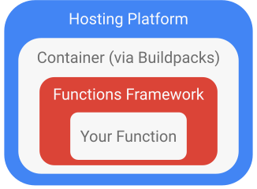

layout: true

.signature[@algogrit]

---

class: center, middle


# Google Cloud Functions

*...and Cloud Run*

Gaurav Agarwal

---

- No servers to provision, manage, or upgrade

- Automatically scale based on the load

- Integrated monitoring, logging, and debugging capability

- Built-in security at role and per function level based on the principle of least privilege

- Key networking capabilities for hybrid and multi-cloud scenarios

---

## What is Serverless?

- No infra management

- Fully managed security

- Pay only for usage

---

## Available Runtimes

- Node.js (First available)

- *Java 11*

- *Go (1.13 & 1.16 preview)*

- PHP

- Python

- Ruby

---
class: center, middle

*Exercise*: Getting our first "Hello from `<your_name>`!" HTTP function out through the UI!

---

- Event-driven
  - Runs code in response to events.

- Scalable
  - Scales automatically without hassle.

- Stateless
  - Cloud Functions don’t hold any in-memory state.

- No management
  - No worries about provisioning and maintaining servers.

- Short lifespan
  - Cloud Function execution time is limited.

---
class: center, middle

Auto load-balancing

---
class: center, middle

Cold-start problem

---

## Numbers to keep in mind

- Limited Memory: 256 MiB

- Max run time: 60 seconds

---

## Types of triggers

### Direct functions

- *HTTP Based*

### Background/*CloudEvent* functions

- *Cloud Pub/Sub*

- *Cloud Storage*

- Cloud Firestore

---

Takes care of:

- details of networking

- autoscaling (even to zero)

- revision tracking

- Universal subscription, delivery, and management of events

---
class: center, middle

## [Functions Framework](https://github.com/GoogleCloudPlatform/functions-framework)

.content-credits[https://cloud.google.com/functions/docs/functions-framework]

---

The Functions Framework lets you write lightweight functions that run in many different environments, including:

- Google Cloud Functions

- Your local development machine (Yay!)

- Cloud Run and Cloud Run on GKE (*More on this later*)

- [Knative-based environments](https://github.com/knative/)

---
class: center, middle



---

### Supports

- [Java](https://github.com/GoogleCloudPlatform/functions-framework-java)

- [Go](https://github.com/GoogleCloudPlatform/functions-framework-go)

- ...

---
class: center, middle

Cloud Shell FTW!

.content-credits[https://cloud.google.com/shell]

---
class: center, middle

Preparing for deploying locally defined functions...

---
class: center, middle

`gcloud`

---
class: center, middle

*Demo*: Defining and deploying a HTTP based function from local

---
class: center, middle

### Developing functions in: *Java*

---
class: center, middle

#### Java HTTP functions

---

*Import*: `com.google.cloud.functions.*`

```java
public interface HttpFunction {
  /**
   * Called to service an incoming HTTP request. This interface is implemented by user code to
   * provide the action for a given function. If the method throws any exception (including any
   * {@link Error}) then the HTTP response will have a 500 status code.
   *
   * @param request a representation of the incoming HTTP request.
   * @param response an object that can be used to provide the corresponding HTTP response.
   * @throws Exception if thrown, the HTTP response will have a 500 status code.
   */
  void service(HttpRequest request, HttpResponse response) throws Exception;
}
```

---
class: center, middle

#### [Functions Framework](https://github.com/GoogleCloudPlatform/functions-framework-java)

```xml
<dependency>
  <groupId>com.google.cloud.functions</groupId>
  <artifactId>functions-framework-api</artifactId>
  <version>1.0.4</version>
  <scope>provided</scope>
</dependency>
```

---
class: center, middle

*Demo*: Writing a simple HTTP function...

---
class: center, middle

```bash
gcloud functions deploy simple-first-function \
  --entry-point Simple \
  --runtime java11 \
  --trigger-http \
  --allow-unauthenticated
```

---
class: center, middle

Let's start with maven...

---
class: center, middle

```bash
mvn archetype:generate -DarchetypeGroupId=io.github.spenceuk \
    -DarchetypeArtifactId=java11-basic-archetype \
    -DarchetypeVersion=1.1 \
    -DgroupId=com.algogrit.app \
    -DartifactId=simple-function \
    -DinteractiveMode=false
```

---
class: center, middle

*Exercise*: [Define and run functions locally](https://github.com/AgarwalConsulting/gcp-training/blob/master/challenges/gcf/01-first-function.md)

.content-credits[https://cloud.google.com/functions/docs/first-java]

---
class: center, middle

Running your Java functions locally...

.content-credits[https://cloud.google.com/functions/docs/running/function-frameworks#functions-local-ff-configure-java]

---
class: center, middle

```xml
<plugin>
  <groupId>com.google.cloud.functions</groupId>
  <artifactId>function-maven-plugin</artifactId>
  <version>0.9.7</version>
  <configuration>
    <functionTarget>com.algogrit.app.HelloHttp</functionTarget>
  </configuration>
</plugin>
```

```bash
mvn function:run -Drun.functionTarget=your.package.yourFunction
```

---
class: center, middle

Invoking locally

.content-credits[https://cloud.google.com/functions/docs/running/calling]

---
class: center, middle

What about internal/private dependencies?

---
class: center, middle

Deploy as a JAR!

.content-credits[https://cloud.google.com/functions/docs/concepts/java-deploy]

---
class: center, middle

```bash
mvn clean package

gcloud functions deploy fn-from-jar \
    --entry-point=com.algogrit.app.HelloHttp \
    --runtime=java11 \
    --trigger-http \
    --allow-unauthenticated \
    --source=target/deployment
```

---
class: center, middle

#### Handling errors & logging

---
class: center, middle

#### Authentication

---

#### Java Frameworks supporting Google Cloud Functions

- [Spring](https://docs.spring.io/spring-cloud-function/docs/current/reference/html/gcp.html#_project_dependencies)

- [Quarkus](https://quarkus.io/guides/gcp-functions)

- ...

---
class: center, middle

### Developing functions in: *Go*

---
class: center, middle

### Cloud Run


---

class: center, middle

Code
https://github.com/algogrit/presentation-gcp-cloud-functions

Slides
https://gcp-cloud-functions.slides.algogrit.com
