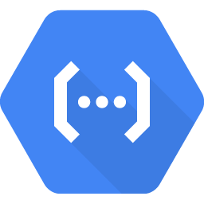

layout: true

.signature[@algogrit]

---

class: center, middle



# Google Cloud Functions

*...and Cloud Run*

Gaurav Agarwal

---

- No servers to provision, manage, or upgrade

- Automatically scale based on the load

- Integrated monitoring, logging, and debugging capability

- Built-in security at role and per function level based on the principle of least privilege

- Key networking capabilities for hybrid and multi-cloud scenarios

---

## What is Serverless?

- No infra management

- Fully managed security

- Pay only for usage

---

## Available Runtimes

- Node.js (First available)

- *Java 11*

- *Go (1.13 & 1.16 preview)*

- PHP

- Python

- Ruby

---
class: center, middle

*Exercise*: Getting our first "Hello from `<your_name>`!" HTTP function out through the UI!

---

- Event-driven
  - Runs code in response to events.

- Scalable
  - Scales automatically without hassle.

- Stateless
  - Cloud Functions don’t hold any in-memory state.

- No management
  - No worries about provisioning and maintaining servers.

- Short lifespan
  - Cloud Function execution time is limited.

---
class: center, middle

Auto load-balancing

---
class: center, middle

Cold-start problem

---

## Numbers to keep in mind

- Limited Memory: 256 MiB

- Max run time: 60 seconds

---

## Types of triggers

### Direct functions

- *HTTP Based*

### Background/*CloudEvent* functions

- *Cloud Pub/Sub*

- *Cloud Storage*

- Cloud Firestore

---

Takes care of:

- details of networking

- autoscaling (even to zero)

- revision tracking

- Universal subscription, delivery, and management of events

---
class: center, middle

## [Functions Framework](https://github.com/GoogleCloudPlatform/functions-framework)

.content-credits[https://cloud.google.com/functions/docs/functions-framework]

---

The Functions Framework lets you write lightweight functions that run in many different environments, including:

- Google Cloud Functions

- Your local development machine (Yay!)

- Cloud Run and Cloud Run on GKE (*More on this later*)

- [Knative-based environments](https://github.com/knative/)

---
class: center, middle


---

### Supports

- [Java](https://github.com/GoogleCloudPlatform/functions-framework-java)

- [Go](https://github.com/GoogleCloudPlatform/functions-framework-go)

- ...

---
class: center, middle

Cloud Shell FTW!

.content-credits[https://cloud.google.com/shell]

---
class: center, middle

Preparing for deploying locally defined functions...

---
class: center, middle

`gcloud`

---
class: center, middle

*Demo*: Deploying a HTTP based function from local

---
class: center, middle

### Developing functions in: *Java*

---
class: center, middle

#### Java HTTP functions

---

*Import*: `com.google.cloud.functions.*`

```java
public interface HttpFunction {
  /**
   * Called to service an incoming HTTP request. This interface is implemented by user code to
   * provide the action for a given function. If the method throws any exception (including any
   * {@link Error}) then the HTTP response will have a 500 status code.
   *
   * @param request a representation of the incoming HTTP request.
   * @param response an object that can be used to provide the corresponding HTTP response.
   * @throws Exception if thrown, the HTTP response will have a 500 status code.
   */
  void service(HttpRequest request, HttpResponse response) throws Exception;
}
```

---
class: center, middle

#### [Functions Framework](https://github.com/GoogleCloudPlatform/functions-framework-java)

```xml
<dependency>
  <groupId>com.google.cloud.functions</groupId>
  <artifactId>functions-framework-api</artifactId>
  <version>1.0.4</version>
  <scope>provided</scope>
</dependency>
```

---
class: center, middle

*Demo*: Writing a simple HTTP function...

---
class: center, middle

```bash
gcloud functions deploy simple-first-function \
  --entry-point Simple \
  --runtime java11 \
  --trigger-http \
  --allow-unauthenticated
```

---
class: center, middle

Let's start with maven...

---
class: center, middle

```bash
mvn archetype:generate -DarchetypeGroupId=io.github.spenceuk \
    -DarchetypeArtifactId=java11-basic-archetype \
    -DarchetypeVersion=1.1 \
    -DgroupId=com.algogrit.app \
    -DartifactId=simple-function \
    -DinteractiveMode=false
```

---
class: center, middle

Let's try deploying again...

---
class: center, middle


#### Cloud Build for CI/CD

---
class: center, middle

Running your Java functions locally...

.content-credits[https://cloud.google.com/functions/docs/running/function-frameworks#functions-local-ff-configure-java]

---
class: center, middle

```xml
<plugin>
  <groupId>com.google.cloud.functions</groupId>
  <artifactId>function-maven-plugin</artifactId>
  <version>0.9.7</version>
  <configuration>
    <functionTarget>com.algogrit.app.HelloHttp</functionTarget>
  </configuration>
</plugin>
```

```bash
mvn function:run -Drun.functionTarget=your.package.yourFunction
```

---
class: center, middle

Invoking locally

.content-credits[https://cloud.google.com/functions/docs/running/calling]

---
class: center, middle

*Exercise*: [Define and run functions locally and deploy](https://github.com/AgarwalConsulting/gcp-training/blob/master/challenges/gcf/01-first-function.md)

.content-credits[https://cloud.google.com/functions/docs/first-java]

---
class: center, middle

What about internal/private dependencies?

---
class: center, middle

Deploy as a JAR!

.content-credits[https://cloud.google.com/functions/docs/concepts/java-deploy]

---
class: center, middle

```xml
<plugin>
  <groupId>org.apache.maven.plugins</groupId>
  <artifactId>maven-shade-plugin</artifactId>
  <executions>
    <execution>
      <phase>package</phase>
      <goals><goal>shade</goal></goals>
      <configuration>
        <outputFile>${project.build.directory}/deployment/${build.finalName}.jar</outputFile>
        <transformers>
          <!-- This may be needed if you need to shade a signed JAR -->
          <transformer implementation="org.apache.maven.plugins.shade.resource.DontIncludeResourceTransformer">
            <resource>.SF</resource>
            <resource>.DSA</resource>
            <resource>.RSA</resource>
          </transformer>
          <!-- This is needed if you have dependencies that use Service Loader. Most Google Cloud client libraries does. -->
          <transformer implementation=
"org.apache.maven.plugins.shade.resource.ServicesResourceTransformer"/>
        </transformers>
      </configuration>
    </execution>
  </executions>
</plugin>
```

---

- Building the Jar

```bash
mvn clean package
```

- Deploying the JAR

```bash
gcloud functions deploy fn-from-jar \
    --entry-point=com.algogrit.app.HelloHttp \
    --runtime=java11 \
    --trigger-http \
    --allow-unauthenticated \
    --source=target/deployment
```

---
class: center, middle

#### Handling errors & logging

.content-credits[https://cloud.google.com/functions/docs/monitoring]

---
class: center, middle

`gcloud functions logs read <fn-name>`

---
class: center, middle

#### Metrics & Quotas

.content-credits[https://console.cloud.google.com/apis/api/cloudfunctions.googleapis.com/metrics]

---
class: center, middle

#### Environment Variables

.content-credits[https://cloud.google.com/functions/docs/configuring/env-var]

---

Predefined environment variables:

- `FUNCTION_TARGET`: The function to be executed.

- `FUNCTION_SIGNATURE_TYPE`: The type of the function: http for HTTP functions, and event for event-driven functions.

- `K_SERVICE`: The name of the function resource.

- `K_REVISION`: The version identifier of the function.

- `PORT`: The port over which the function is invoked.

.content-credits[https://cloud.google.com/functions/docs/configuring/env-var#newer_runtimes]

---
class: center, middle


#### Cloud Storage

---
class: center, middle

Google Cloud Storage is a RESTful online file storage web service for storing and accessing data on Google Cloud Platform infrastructure.

It's an object storage service.

---

Programmatic Access:

- `gsutil`

- [Java library](https://cloud.google.com/storage/docs/reference/libraries)

---
class: center, middle

```xml
<dependencyManagement>
  <dependencies>
    <dependency>
      <groupId>com.google.cloud</groupId>
      <artifactId>libraries-bom</artifactId>
      <version>22.0.0</version>
      <type>pom</type>
      <scope>import</scope>
    </dependency>
  </dependencies>
</dependencyManagement>

<dependencies>
  <dependency>
    <groupId>com.google.cloud</groupId>
    <artifactId>google-cloud-storage</artifactId>
  </dependency>
</dependencies>
```

.content-credits[https://cloud.google.com/storage/docs/reference/libraries]

---

Uploading files to a Cloud Function using Cloud Storage is a three step process:

- Clients call a Cloud Function directly to retrieve a signed URL.

- Clients then send file data to the signed URL via an HTTP PUT request.

- A second Cloud Function is triggered by the mutation in the storage bucket to further process the file.

.content-credits[https://cloud.google.com/functions/docs/writing/http#uploading_files_via_cloud_storage]

---
class: center, middle

#### Background functions

---

```java
@FunctionalInterface
public interface BackgroundFunction<T> {
  /**
   * Called to service an incoming event. This interface is implemented by user code to
   * provide the action for a given background function. If this method throws any exception
   * (including any {@link Error}) then the HTTP response will have a 500 status code.
   *
   * @param payload the payload of the event, deserialized from the original JSON string.
   * @param context the context of the event. This is a set of values that every event has,
   *     separately from the payload, such as timestamp and event type.
   * @throws Exception to produce a 500 status code in the HTTP response.
   */
  void accept(T payload, Context context) throws Exception;
}
```

---

Supported event sources:

- Cloud Storage

- Cloud Pub/Sub

---

Cloud Storage Triggers:

- google.storage.object.finalize (default)

  This event is sent when a new object is created (or an existing object is overwritten, and a new generation of that object is created) in the bucket.

- google.storage.object.delete

  This event is sent when an object is permanently deleted.

- google.storage.object.archive

  This event is sent when a live version of an object is archived or deleted.

- google.storage.object.metadataUpdate

  This event is sent when the metadata of an existing object changes.

.content-credits[https://cloud.google.com/functions/docs/calling/storage#functions-calling-storage-java]

---
class: center, middle

Storage event data is delivered in the *Cloud Storage [object](https://cloud.google.com/storage/docs/json_api/v1/objects#resource)* format.

---

```json
{
  "kind": "storage#object",
  "id": string,
  "selfLink": string,
  "name": string,
  "bucket": string,
  "generation": "long",
  "metageneration": "long",
  "contentType": string,
  "timeCreated": "datetime",
  "updated": "datetime",
  "customTime": "datetime",
  "timeDeleted": "datetime",
  "temporaryHold": boolean,
  "eventBasedHold": boolean,
  "retentionExpirationTime": "datetime",
  "storageClass": string,
  "timeStorageClassUpdated": "datetime",
  "size": "unsigned long",
  "md5Hash": string,
  "mediaLink": string,
  "contentEncoding": string,
  "contentDisposition": string,
  "contentLanguage": string,
  "cacheControl": string,
  "metadata": {
    (key): string
  },
  "acl": [
    objectAccessControls Resource
  ],
  "owner": {
    "entity": string,
    "entityId": string
  },
  "crc32c": string,
  "componentCount": integer,
  "etag": string,
  "customerEncryption": {
    "encryptionAlgorithm": string,
    "keySha256": string
  },
  "kmsKeyName": string
}
```

.content-credits[https://cloud.google.com/storage/docs/json_api/v1/objects#resource]

---
class: center, middle

*Demo*: Writing a File upload processing function

---

Triggering background function locally:

```bash
curl localhost:8080 \
  -X POST \
  -H "Content-Type: application/json" \
  -d '{
        "context": {
          "eventId": "1147091835525187",
          "timestamp": "2020-04-23T07:38:57.772Z",
          "eventType": "google.storage.object.finalize",
          "resource": {
             "service": "storage.googleapis.com",
             "name": "projects/_/buckets/MY_BUCKET/MY_FILE.txt",
             "type": "storage#object"
          }
        },
        "data": {
          "bucket": "MY_BUCKET",
          "contentType": "text/plain",
          "kind": "storage#object",
          "md5Hash": "...",
          "metageneration": "1",
          "name": "MY_FILE.txt",
          "size": "352",
          "storageClass": "MULTI_REGIONAL",
          "timeCreated": "2020-04-23T07:38:57.230Z",
          "timeStorageClassUpdated": "2020-04-23T07:38:57.230Z",
          "updated": "2020-04-23T07:38:57.230Z"
        }
      }'
```

.content-credits[https://cloud.google.com/functions/docs/running/calling#background-function-curl-tabs-storage]

---
class: center, middle

*Exercise*: [Read and encrypt files uploaded to GCS](https://github.com/AgarwalConsulting/gcp-training/blob/master/challenges/gcf/02-file-encryption.md)

---
class: center, middle

#### Testing

.content-credits[https://cloud.google.com/functions/docs/testing/test-basics]

---

Types of Testing:

- Unit Testing

  Unit tests are narrowly-scoped tests for small, specific parts of your code. These tests can quickly verify assumptions made during the development process, such as handling edge cases and input validation.

- Integration Testing

  Integration tests validate interaction between parts of your code, and typically take a moderate amount of time to complete. For example, in Cloud Functions, integration tests can be used to test a function's usage of other Google Cloud services such as Datastore or Cloud Vision.

- System Tests

  System tests are more complex tests that validate the behavior of your Cloud Function across multiple Google Cloud components in an isolated test environment.

---
class: center, middle

#### Networking

.content-credits[https://cloud.google.com/functions/docs/networking/connecting-vpc]

---
class: center, middle

#### Security

.content-credits[https://cloud.google.com/functions/docs/securing]

---

There are two approaches to controlling access for Cloud Functions:

- Identity-based
- Network-based

---

#### Java Frameworks supporting Google Cloud Functions

- [Spring](https://docs.spring.io/spring-cloud-function/docs/current/reference/html/gcp.html#_project_dependencies)

- [Quarkus](https://quarkus.io/guides/gcp-functions)

- ...

---
class: center, middle

### Developing functions in: *Go*

---
class: center, middle

### Cloud Run


---

class: center, middle

Code
https://github.com/algogrit/presentation-gcp-cloud-functions

Slides
https://gcp-cloud-functions.slides.algogrit.com
