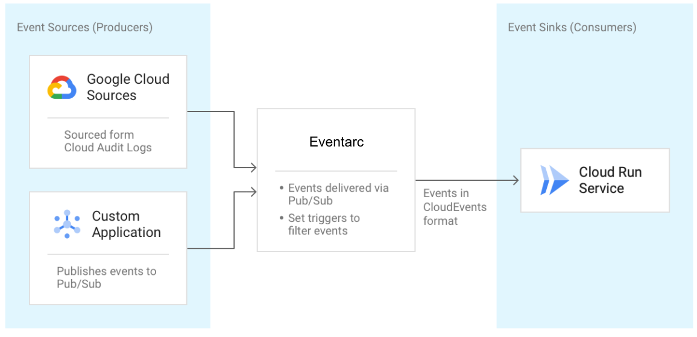

layout: true

.signature[@algogrit]

---

class: center, middle


# Google Cloud Functions

*...and Cloud Run*

Gaurav Agarwal

---

- No servers to provision, manage, or upgrade

- Automatically scale based on the load

- Integrated monitoring, logging, and debugging capability

- Built-in security at role and per function level based on the principle of least privilege

- Key networking capabilities for hybrid and multi-cloud scenarios

---

## What is Serverless?

- No infra management

- Fully managed security

- Pay only for usage

---

## Available Runtimes

- Node.js (First available)

- *Java 11*

- *Go (1.13 & 1.16 preview)*

- PHP

- Python

- Ruby

---
class: center, middle

*Exercise*: Getting our first "Hello from `<your_name>`!" HTTP function out through the UI!

---

- Event-driven
  - Runs code in response to events.

- Scalable
  - Scales automatically without hassle.

- Stateless
  - Cloud Functions don’t hold any in-memory state.

- No management
  - No worries about provisioning and maintaining servers.

- Short lifespan
  - Cloud Function execution time is limited.

---
class: center, middle

Auto load-balancing

---
class: center, middle

Cold-start problem

---

## Numbers to keep in mind

- Limited Memory: 256 MiB

- Max run time: 60 seconds

---

## Types of triggers

### Direct functions

- *HTTP Based*

### Background/*CloudEvent* functions

- *Cloud Pub/Sub*

- *Cloud Storage*

- Cloud Firestore

---

Takes care of:

- details of networking

- autoscaling (even to zero)

- revision tracking

- Universal subscription, delivery, and management of events

---
class: center, middle

## [Functions Framework](https://github.com/GoogleCloudPlatform/functions-framework)

.content-credits[https://cloud.google.com/functions/docs/functions-framework]

---

The Functions Framework lets you write lightweight functions that run in many different environments, including:

- Google Cloud Functions

- Your local development machine (Yay!)

- Cloud Run and Cloud Run on GKE (*More on this later*)

- [Knative-based environments](https://github.com/knative/)

---
class: center, middle


---

### Supports

- [Java](https://github.com/GoogleCloudPlatform/functions-framework-java)

- [Go](https://github.com/GoogleCloudPlatform/functions-framework-go)

- ...

---
class: center, middle

Cloud Shell FTW!

.content-credits[https://cloud.google.com/shell]

---
class: center, middle

Preparing for deploying locally defined functions...

---
class: center, middle

`gcloud`

---
class: center, middle

*Demo*: Deploying a HTTP based function from local

---
class: center, middle

### Developing functions in: *Java*

---
class: center, middle

#### Java HTTP functions

---

*Import*: `com.google.cloud.functions.*`

```java
public interface HttpFunction {
  /**
   * Called to service an incoming HTTP request. This interface is implemented by user code to
   * provide the action for a given function. If the method throws any exception (including any
   * {@link Error}) then the HTTP response will have a 500 status code.
   *
   * @param request a representation of the incoming HTTP request.
   * @param response an object that can be used to provide the corresponding HTTP response.
   * @throws Exception if thrown, the HTTP response will have a 500 status code.
   */
  void service(HttpRequest request, HttpResponse response) throws Exception;
}
```

---
class: center, middle

#### [Functions Framework](https://github.com/GoogleCloudPlatform/functions-framework-java)

```xml
<dependency>
  <groupId>com.google.cloud.functions</groupId>
  <artifactId>functions-framework-api</artifactId>
  <version>1.0.4</version>
  <scope>provided</scope>
</dependency>
```

---
class: center, middle

*Demo*: Writing a simple HTTP function...

---
class: center, middle

```bash
gcloud functions deploy simple-first-function \
  --entry-point Simple \
  --runtime java11 \
  --trigger-http \
  --allow-unauthenticated
```

---
class: center, middle

Let's start with maven...

---
class: center, middle

```bash
mvn archetype:generate -DarchetypeGroupId=io.github.spenceuk \
    -DarchetypeArtifactId=java11-basic-archetype \
    -DarchetypeVersion=1.1 \
    -DgroupId=com.algogrit.app \
    -DartifactId=simple-function \
    -DinteractiveMode=false
```

---
class: center, middle

Let's try deploying again...

---
class: center, middle


#### Cloud Build for CI/CD

---
class: center, middle

Running your Java functions locally...

.content-credits[https://cloud.google.com/functions/docs/running/function-frameworks#functions-local-ff-configure-java]

---
class: center, middle

```xml
<plugin>
  <groupId>com.google.cloud.functions</groupId>
  <artifactId>function-maven-plugin</artifactId>
  <version>0.9.7</version>
  <configuration>
    <functionTarget>com.algogrit.app.HelloHttp</functionTarget>
  </configuration>
</plugin>
```

```bash
mvn function:run -Drun.functionTarget=your.package.yourFunction
```

---
class: center, middle

Invoking locally

.content-credits[https://cloud.google.com/functions/docs/running/calling]

---
class: center, middle

*Exercise*: [Define and run functions locally and deploy](https://github.com/AgarwalConsulting/gcp-training/blob/master/challenges/gcf/01-first-function.md)

.content-credits[https://cloud.google.com/functions/docs/first-java]

---
class: center, middle

What about internal/private dependencies?

---
class: center, middle

Deploy as a JAR!

.content-credits[https://cloud.google.com/functions/docs/concepts/java-deploy]

---
class: center, middle

```xml
<plugin>
  <groupId>org.apache.maven.plugins</groupId>
  <artifactId>maven-shade-plugin</artifactId>
  <executions>
    <execution>
      <phase>package</phase>
      <goals><goal>shade</goal></goals>
      <configuration>
        <outputFile>${project.build.directory}/deployment/${build.finalName}.jar</outputFile>
        <transformers>
          <!-- This may be needed if you need to shade a signed JAR -->
          <transformer implementation="org.apache.maven.plugins.shade.resource.DontIncludeResourceTransformer">
            <resource>.SF</resource>
            <resource>.DSA</resource>
            <resource>.RSA</resource>
          </transformer>
          <!-- This is needed if you have dependencies that use Service Loader. Most Google Cloud client libraries does. -->
          <transformer implementation=
"org.apache.maven.plugins.shade.resource.ServicesResourceTransformer"/>
        </transformers>
      </configuration>
    </execution>
  </executions>
</plugin>
```

---

- Building the Jar

```bash
mvn clean package
```

- Deploying the JAR

```bash
gcloud functions deploy fn-from-jar \
    --entry-point=com.algogrit.app.HelloHttp \
    --runtime=java11 \
    --trigger-http \
    --allow-unauthenticated \
    --source=target/deployment
```

---
class: center, middle

#### Handling errors & logging

.content-credits[https://cloud.google.com/functions/docs/monitoring]

---
class: center, middle

`gcloud functions logs read <fn-name>`

---
class: center, middle

#### Metrics & Quotas

.content-credits[https://console.cloud.google.com/apis/api/cloudfunctions.googleapis.com/metrics]

---
class: center, middle


#### Cloud Storage

---
class: center, middle

Google Cloud Storage is a RESTful online file storage web service for storing and accessing data on Google Cloud Platform infrastructure.

It's an object storage service.

---

Programmatic Access:

- `gsutil`

- [Java library](https://cloud.google.com/storage/docs/reference/libraries)

- [Go library](https://pkg.go.dev/cloud.google.com/go/storage)

.content-credits[https://cloud.google.com/storage/docs/reference/libraries]

---
class: center, middle

```xml
<dependencyManagement>
  <dependencies>
    <dependency>
      <groupId>com.google.cloud</groupId>
      <artifactId>libraries-bom</artifactId>
      <version>22.0.0</version>
      <type>pom</type>
      <scope>import</scope>
    </dependency>
  </dependencies>
</dependencyManagement>

<dependencies>
  <dependency>
    <groupId>com.google.cloud</groupId>
    <artifactId>google-cloud-storage</artifactId>
  </dependency>
</dependencies>
```

.content-credits[https://cloud.google.com/storage/docs/reference/libraries]

---

Uploading files to a Cloud Function using Cloud Storage is a three step process:

- Clients call a Cloud Function directly to retrieve a signed URL.

- Clients then send file data to the signed URL via an HTTP PUT request.

- A second Cloud Function is triggered by the mutation in the storage bucket to further process the file.

.content-credits[https://cloud.google.com/functions/docs/writing/http#uploading_files_via_cloud_storage]

---
class: center, middle

#### Background functions

---

```java
@FunctionalInterface
public interface BackgroundFunction<T> {
  /**
   * Called to service an incoming event. This interface is implemented by user code to
   * provide the action for a given background function. If this method throws any exception
   * (including any {@link Error}) then the HTTP response will have a 500 status code.
   *
   * @param payload the payload of the event, deserialized from the original JSON string.
   * @param context the context of the event. This is a set of values that every event has,
   *     separately from the payload, such as timestamp and event type.
   * @throws Exception to produce a 500 status code in the HTTP response.
   */
  void accept(T payload, Context context) throws Exception;
}
```

---

Supported event sources:

- Cloud Storage

- Cloud Pub/Sub

---

Cloud Storage Triggers:

- google.storage.object.finalize (default)

  This event is sent when a new object is created (or an existing object is overwritten, and a new generation of that object is created) in the bucket.

- google.storage.object.delete

  This event is sent when an object is permanently deleted.

- google.storage.object.archive

  This event is sent when a live version of an object is archived or deleted.

- google.storage.object.metadataUpdate

  This event is sent when the metadata of an existing object changes.

.content-credits[https://cloud.google.com/functions/docs/calling/storage#functions-calling-storage-java]

---
class: center, middle

Storage event data is delivered in the *Cloud Storage [object](https://cloud.google.com/storage/docs/json_api/v1/objects#resource)* format.

---

```json
{
  "kind": "storage#object",
  "id": string,
  "selfLink": string,
  "name": string,
  "bucket": string,
  "generation": "long",
  "metageneration": "long",
  "contentType": string,
  "timeCreated": "datetime",
  "updated": "datetime",
  "customTime": "datetime",
  "timeDeleted": "datetime",
  "temporaryHold": boolean,
  "eventBasedHold": boolean,
  "retentionExpirationTime": "datetime",
  "storageClass": string,
  "timeStorageClassUpdated": "datetime",
  "size": "unsigned long",
  "md5Hash": string,
  "mediaLink": string,
  "contentEncoding": string,
  "contentDisposition": string,
  "contentLanguage": string,
  "cacheControl": string,
  "metadata": {
    (key): string
  },
  "acl": [
    objectAccessControls Resource
  ],
  "owner": {
    "entity": string,
    "entityId": string
  },
  "crc32c": string,
  "componentCount": integer,
  "etag": string,
  "customerEncryption": {
    "encryptionAlgorithm": string,
    "keySha256": string
  },
  "kmsKeyName": string
}
```

.content-credits[https://cloud.google.com/storage/docs/json_api/v1/objects#resource]

---
class: center, middle

*Demo*: Writing a File upload processing function

---

Triggering background function locally:

```bash
curl localhost:8080 \
  -X POST \
  -H "Content-Type: application/json" \
  -d '{
        "context": {
          "eventId": "1147091835525187",
          "timestamp": "2020-04-23T07:38:57.772Z",
          "eventType": "google.storage.object.finalize",
          "resource": {
             "service": "storage.googleapis.com",
             "name": "projects/_/buckets/MY_BUCKET/MY_FILE.txt",
             "type": "storage#object"
          }
        },
        "data": {
          "bucket": "MY_BUCKET",
          "contentType": "text/plain",
          "kind": "storage#object",
          "md5Hash": "...",
          "metageneration": "1",
          "name": "MY_FILE.txt",
          "size": "352",
          "storageClass": "MULTI_REGIONAL",
          "timeCreated": "2020-04-23T07:38:57.230Z",
          "timeStorageClassUpdated": "2020-04-23T07:38:57.230Z",
          "updated": "2020-04-23T07:38:57.230Z"
        }
      }'
```

.content-credits[https://cloud.google.com/functions/docs/running/calling#background-function-curl-tabs-storage]

---
class: center, middle

*Exercise*: [Read and encrypt files uploaded to GCS](https://github.com/AgarwalConsulting/gcp-training/blob/master/challenges/gcf/02-file-encryption.md)

---
class: center, middle

#### CloudEvent functions

.content-credits[https://cloud.google.com/functions/docs/writing/cloudevents]

---
class: center, middle

A CloudEvent function is one type of event-driven function. CloudEvent functions are invoked indirectly in response to events, such as a message on a Pub/Sub topic, a change in a Cloud Storage bucket, or a Firebase event.

---

- Conceptually similar to background functions.

- The principal difference between the two is that CloudEvent functions use an industry-standard event format known as [CloudEvents](https://cloudevents.io/).

---
class: center, middle

#### Testing

.content-credits[https://cloud.google.com/functions/docs/testing/test-basics]

---

Types of Testing:

- Unit Testing

  Unit tests are narrowly-scoped tests for small, specific parts of your code. These tests can quickly verify assumptions made during the development process, such as handling edge cases and input validation.

- Integration Testing

  Integration tests validate interaction between parts of your code, and typically take a moderate amount of time to complete. For example, in Cloud Functions, integration tests can be used to test a function's usage of other Google Cloud services such as Datastore or Cloud Vision.

- System Tests

  System tests are more complex tests that validate the behavior of your Cloud Function across multiple Google Cloud components in an isolated test environment.

---
class: center, middle

Unit Testing HTTP functions

.content-credits[https://cloud.google.com/functions/docs/testing/test-http#unit_tests]

---
class: center, middle

Integration Testing Background functions

.content-credits[https://cloud.google.com/functions/docs/testing/test-event#integration_tests_2]

---
class: center, middle

#### Networking

.content-credits[https://cloud.google.com/functions/docs/networking/connecting-vpc]

---
class: center, middle

##### Serverless VPC Access

.content-credits[https://cloud.google.com/vpc/docs/serverless-vpc-access]

---
class: center, middle

Serverless VPC Access makes it possible for you to connect directly to your Virtual Private Cloud network from serverless environments such as Cloud Run, App Engine, or Cloud Functions.

Configuring Serverless VPC Access allows your serverless environment to send requests to your VPC network using internal DNS and internal IP addresses.

.content-credits[https://console.cloud.google.com/apis/api/vpcaccess.googleapis.com/overview]

---
class: center, middle


---

There are two main benefits to using Serverless VPC Access:

- Requests sent to your VPC network are never exposed to the internet.

- Communication through Serverless VPC Access can have less latency compared to the internet.

---

- Serverless VPC Access is based on a resource called a connector.

- A connector handles traffic between your serverless environment and your VPC network.

- When you create a connector in your Google Cloud project, you attach it to a specific VPC network and region.

- You can then configure your serverless services to use the connector for outbound network traffic.

---
class: center, middle

You can enforce a VPC connector for Cloud Functions with a organization level policy: `constraints/cloudfunctions.requireVPCConnector`.

.content-credits[https://cloud.google.com/resource-manager/docs/organization-policy/org-policy-constraints#available_constraints]

---
class: center, middle

Create a connector

```bash
gcloud compute networks vpc-access connectors create CONNECTOR_NAME \
  --region REGION \
  --subnet SUBNET \
  # If you are not using Shared VPC, omit the following line.
  --subnet-project HOST_PROJECT_ID \
  # Optional: specify minimum and maximum instance values between 2 and 10, default is 2 min, 10 max.
  --min-instances MIN \
  --max-instances MAX \
  # Optional: specify machine type, default is e2-micro
  --machine-type MACHINE_TYPE
```

---

- `CONNECTOR_NAME`: a name for your connector. This must be in accordance with the Compute Engine naming convention.

- `REGION`: a region for your connector; this must match the region of your serverless service. If your service is in the region us-central or europe-west, use us-central1 or europe-west1.

- `SUBNET`: your own `'/28'` dedicated subnet that is not used by any other resource; the value to be supplied is name of the subnet

- `HOST_PROJECT_ID`: the ID of the host project; supply this only if you are using Shared VPC

- `MIN`: the minimum number of instances to use for the connector. Use an integer between 2 and 10. Default is 2.

- `MAX`: the maximum number of instances to use for the connector. Use an integer between 2 and 10. Default is 10. If traffic requires it, the connector scales out to `[MAX]` instances, but does not scale back in.

- `MACHINE_TYPE`: `f1-micro`, `e2-micro`, or `e2-standard-4`

---

There are two options for setting the IP address range for a connector:

- Subnet: You can specify an existing /28 subnet if there are no resources already using the subnet.

- CIDR range: You can specify an unused /28 CIDR range. Make sure that the range doesn't overlap with any in-use CIDR ranges.
Traffic sent through the connector into your VPC network originates from the subnet or CIDR range that you specify.

---
class: center, middle

Verify if connector is ready

```bash
gcloud compute networks vpc-access connectors describe CONNECTOR_NAME \
--region REGION
```

---

For Cloud Functions:

- Expand the advanced settings by clicking RUNTIME, BUILD AND CONNECTIONS SETTINGS.

- In the Connections tab under Egress settings, enter the name of your connector in the VPC connector field, or clear the field to disconnect your service from a VPC network.

---
class: center, middle

VPC Connector flag for `gcloud functions deploy`

`--vpc-connector CONNECTOR_NAME`

---
class: center, middle

Use the `--clear-vpc-connector` flag to to disconnect your function from a VPC network

---

Cloud Functions network settings enable you to control network ingress and egress to and from individual functions. For example, you can use network settings for the following use cases:

- Secure your functions by implementing network-based access control.

- Make a function's egress traffic adhere to firewall, DNS, and routing rules associated with your VPC network.

- Associate a function's egress traffic with a static IP address.

.content-credits[https://cloud.google.com/functions/docs/networking/network-settings]

---

Use cases:

- Creating a function that cannot be called by external clients

- Routing function egress through your VPC network

- Associating function egress with a static IP address

- Multi-region load balancing

.content-credits[https://cloud.google.com/functions/docs/networking/network-settings#examples]

---

#### Java Frameworks supporting Google Cloud Functions

- [Spring](https://docs.spring.io/spring-cloud-function/docs/current/reference/html/gcp.html#_project_dependencies)

- [Quarkus](https://quarkus.io/guides/gcp-functions)

- ...

---
class: center, middle

### Developing functions in: *Go*

---

#### [Go Fundamentals](https://go-fundamentals.slides.algogrit.com/)

- Variables / Functions

- Package / `go mod`

- Loops

- Slices / Maps

- Structs

- Methods / Interfaces

.content-credits[http://why-go.slides.algogrit.com/]

---
class: center, middle

#### Go HTTP functions

---
class: center, middle

`net/http`

.content-credits[https://golang.org/pkg/net/http/]

---
class: center, middle

```golang
type HandlerFunc func(ResponseWriter, *Request)
```

.content-credits[https://pkg.go.dev/net/http#HandlerFunc]

---
class: center, middle

#### Running locally

---
class: center, middle

```bash
go install github.com/GoogleCloudPlatform/functions-framework-go/funcframework
```

.content-credits[https://github.com/GoogleCloudPlatform/functions-framework-go]

---
class: center, middle

`funcframework.RegisterHTTPFunctionContext`
`funcframework.RegisterEventFunctionContext`
`funcframework.RegisterCloudEventFunctionContext`

---
class: center, middle

#### Security

.content-credits[https://cloud.google.com/functions/docs/securing]

---
class: center, middle

#### Authorization

---

- [Basic Auth](https://github.com/AgarwalConsulting/Go-Training/blob/master/examples/11-A-01-net/auth/basic/main.go#L12)

- [JWT](https://github.com/golang-jwt/jwt)

---

There are two approaches to controlling access for Cloud Functions:

- Identity-based

- Network-based

---
class: center, middle

##### Identity-based

---
class: center, middle

```bash
gcloud functions get-iam-policy FUNCTION_NAME

gcloud functions add-iam-policy-binding FUNCTION_NAME \
  --member=MEMBER_ID \
  --role=ROLE

gcloud functions remove-iam-policy-binding FUNCTION_NAME \
  --member=MEMBER_ID \
  --role=ROLE
```

---
class: center, middle

Authentication for invoking

```bash
curl https://REGION-PROJECT_ID.cloudfunctions.net/FUNCTION_NAME \
  -H "Authorization: bearer $(gcloud auth print-identity-token)"
```

---
class: center, middle

Authenticating function to function calls

```bash
gcloud functions add-iam-policy-binding RECEIVING_FUNCTION \
  --member='serviceAccount:CALLING_FUNCTION_IDENTITY' \
  --role='roles/cloudfunctions.invoker'
```

---
class: center, middle

[Generating tokens manually](https://cloud.google.com/functions/docs/securing/authenticating?authuser=2#generating_tokens_manually)

---
class: center, middle

##### Network-based

---
class: center, middle

Restrict allowed ingress settings

```bash
gcloud resource-manager org-policies allow \
  cloudfunctions.allowedIngressSettings ALLOW_INTERNAL_ONLY \
  --organization ORGANIZATION_ID
```

.content-credits[https://cloud.google.com/functions/docs/securing/using-vpc-service-controls]

---
class: center, middle

#### Environment Variables

.content-credits[https://cloud.google.com/functions/docs/configuring/env-var]

---
class: center, middle

Setting env variables individually: `--set-env-vars FOO=bar,BAZ=boo`

---
class: center, middle

Setting env variables from a file: `--env-vars-file .env.yaml`

---

Other operations on Environment Variables:

- `--update-env-vars FOO=notbar`

- `--remove-env-vars FOO,BAZ`

- `--clear-env-vars`

---

Predefined environment variables:

- `FUNCTION_TARGET`: The function to be executed.

- `FUNCTION_SIGNATURE_TYPE`: The type of the function: http for HTTP functions, and event for event-driven functions.

- `K_SERVICE`: The name of the function resource.

- `K_REVISION`: The version identifier of the function.

- `PORT`: The port over which the function is invoked.

.content-credits[https://cloud.google.com/functions/docs/configuring/env-var#newer_runtimes]

---
class: center, middle

#### Secret Manager

.content-credits[https://cloud.google.com/functions/docs/configuring/secrets]

---
class: center, middle

Secret Manager stores API keys, passwords, certificates, and other sensitive data.

---
class: center, middle

#### Scaling Functions

---
class: center, middle

##### Setting maximum instances

`--max-instances`

---

Why Maximum Instances?

- limit requests to throughput-constrained or unscalable downstream services

- improves overall system stability and helps guard against abnormally high request levels

.content-credits[https://cloud.google.com/functions/docs/configuring/max-instances]

---
class: center, middle

Cloud Functions attempts to serve a new inbound request for up to 30 seconds

---
class: center, middle

In some cases, such as rapid traffic surges, Cloud Functions might, for a short period of time, create more instances than the specified maximum instances limit.

.content-credits[https://cloud.google.com/functions/docs/configuring/max-instances#handling_traffic_spikes]

---
class: center, middle

Setting maximum instances to 0 results in clearing existing maximum instances limits.

---
class: center, middle

##### Setting minimum instances (Pre-GA)

`--min-instances`

---

Why minimum instances?

- Each function instances can handle only one request at a time

- large spikes in request volume often cause longer wait times as new instances are created to handle the demand

- function sometimes initializes the execution environment from scratch, which is called a *cold start*

.content-credits[https://cloud.google.com/functions/docs/configuring/min-instances]

---
class: center, middle

Setting a minimum number of instances incurs cost.

---
class: center, middle

Use `--clear-min-instances` flag to clear

---
class: center, middle

### Cloud Run


.content-credits[https://cloud.google.com/run/docs]

---
class: center, middle

Cloud Run is a managed compute platform that enables you to run containers that are invocable via requests or events. Cloud Run is serverless: it abstracts away all infrastructure management, so you can focus on what matters most — building great applications.

.content-credits[https://cloud.google.com/run/docs/setup]

---

Code requirements:

- The service must listen for requests. You can configure the port on which requests are sent. Inside Cloud Run container instances, the value of the PORT environment variable always reflects the port to which requests are sent. Your code should check for the existence of this PORT environment variable and if it is present, should listen on it to maximize portability.

- The service must be stateless. It cannot rely on a persistent local state.

- The service must not perform background activities outside the scope of request handling.

.content-credits[https://cloud.google.com/run/docs/developing]

---
class: center, middle

*Demo*: Deploying to Cloud run *from source*

---
class: center, middle

To deploy to Cloud Run, you need to provide a container image.

.content-credits[https://cloud.google.com/run/docs/building/containers]

---
class: center, middle

Functions Framework *refresher*


---
class: center, middle

*Demo*: Deploying to Cloud run *from container*

---
class: center, middle

#### Eventarc

.content-credits[https://www.infoq.com/news/2021/01/google-cloud-eventarc-ga/]

---
class: center, middle

Eventarc lets you asynchronously deliver events from Google services, SaaS, and your own apps using loosely coupled services that react to state changes.

---
class: center, middle


.image-credits[https://codelabs.developers.google.com/codelabs/cloud-run-events#1]

---
class: center, middle

Current State



.image-credits[https://codelabs.developers.google.com/codelabs/cloud-run-events#2]

---
class: center, middle

Events are normalized to [CloudEvents v1.0](https://cloudevents.io/) format for cross-service interoperability. CloudEvents is a vendor-neutral open spec describing event data in common formats, enabling interoperability across services, platforms and systems.

.content-credits[https://codelabs.developers.google.com/codelabs/cloud-run-events#1]

---
class: center, middle

## Comparison

---
class: center, middle

### Cloud Functions vs Cloud Run

---
class: center, middle

### Cloud Functions vs App Engine

---
class: center, middle

### Cloud Functions vs GKE

---
class: center, middle

### Cloud Functions vs Compute Engine

---
class: center, middle

Code
https://github.com/algogrit/presentation-gcp-cloud-functions

Slides
https://gcp-cloud-functions.slides.algogrit.com
